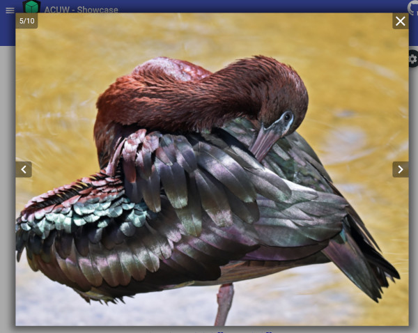
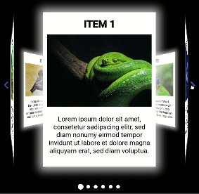

# ngx-acuw (Angular Components using WEBGL)

ngx-acuw is a collection of components for Angular made with the 3D library three.js.


[](/LICENSE)

[](https://www.npmjs.com/package/ngx-acuw)

## Showcase and Description
[ngx-acuw](https://windmichael.github.io/ngx-acuw/)

## Dependencies
* [three.js](https://threejs.org) (*requires* threejs )
* [@types/three](https://www.npmjs.com/package/@types/three) (*requires* @types/three )
* [@angular/cdk](https://material.angular.io/cdk/categories) (*requires* @angular/cdk )

## Installation
```
npm install three @types/three @angular/cdk ngx-acuw
```

## Components
<table>
  <tr>
    <th>Image As Particles</th>
    <th>Image Transition</th>
    <th>Lightbox</th>
    <th>Carousel</th>
  </tr>
  <tr>
    <td></td>
    <td></td>
    <td></td>
    <td></td>
  </tr>
  <tr>
    <td></td>
    <td><a href="https://stackblitz.com/edit/ngx-acuw-image-transition">stackblitz<a/></td>
    <td><a href="https://stackblitz.com/edit/angular-ngx-acuw-lightbox">stackblitz<a/></td>
    <td><a href="https://stackblitz.com/edit/ngx-acuw-carousel">stackblitz<a/></td>
  </tr>
</table>
